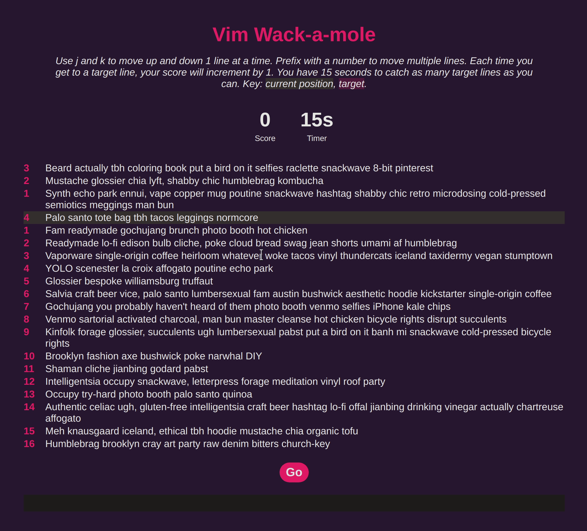

# Vim Wack-a-mole

## Introduction

Vim Wack-a-mole is a small browser based game intended to help users practice
the up and down movement used in the Vim text editor with the keys "j" for
down, and "k" for up.

Still to do:

- Typescript once happy with POC
- Tests
- Global state manager like Zustand
- Session leaderboard
- Github Actions to host it on Github Pages
- Variable difficulty
- Limited time to get to target, quicker to target more points awarded
- 2D movement with a cursor position rather than only line position

## Built with

- React
- Snowpack
- react-hotkeys-hook
- react-dom-confetti

## Usage

1. Click start!
2. Use the "j" and "k" keys to travel to the target line, if you'd like to move
more than 1 line at a time, prefix the command with a number.
3. Once you reach the target line, your score will tick up 1 point and a new
line will become the target.
4. Try to get quicker and beat your score for a 15 second round!
5. Clicking start or pressing "enter" will reset the score and timer to go
again.



## Running locally

```bash # Install dependencies npm i

# Start the server npm start

```

